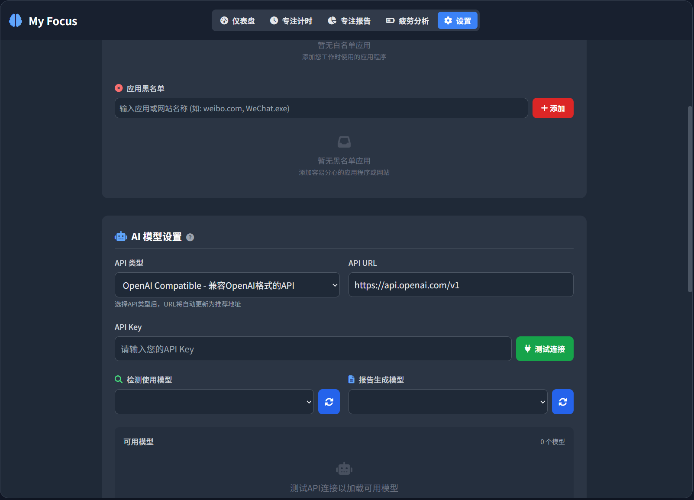

<p align="center">
  
</p>

<p align="center">
<b>My Focus - 专注度监控应用</b><br>


</p>


My Focus 是一个基于 Tauri 框架开发的桌面专注度监控应用，旨在帮助用户提高工作效率和专注力。通过智能监控系统和 AI 分析，实时评估用户的专注状态，提供个性化的专注力提升建议。



## ✨ 功能特色

### 已完成的核心功能

#### 智能监控系统
- **实时屏幕监控**: 定期截取屏幕快照进行 AI 分析
- **应用程序跟踪**: 监控活跃应用程序并进行分类管理
- **专注状态评估**: 通过 AI 分析判断用户当前专注程度（专注/分心/严重分心）
- **智能干预提醒**: 检测到分心时及时给出温和提醒

#### 灵活配置系统
- **多 AI 平台支持**: 支持 OpenAI Compatible API、Ollama、Claude 等多种 AI 服务
- **个性化设置**: 可自定义监控间隔、干预设置、应用白名单/黑名单
- **数据本地化**: 所有配置和数据完全存储在本地，保护用户隐私

#### 数据分析与报告
- **专注度统计**: 详细的专注时间和效率统计
- **历史数据分析**: 长期专注趋势分析和改进建议
- **任务管理**: 集成的任务跟踪和完成情况统计

### 开发中的功能以及未来完善方向
- **AI 提供个性化建议**: AI分析师
- **高级数据可视化**: 更丰富的图表和分析报告
- **智能学习算法**: 基于用户行为的个性化专注模式学习
- **团队协作功能**: 团队专注度监控和比较
- **多模态同步输入判断**: 人脸表情检测等方式 
- **移动端同步**: 跨设备数据同步和远程监控
- **插件系统**: 第三方扩展和自定义功能支持
- **更多 AI 集成**: 支持更多 AI 平台和本地化模型

## 🔒 隐私保护

**My Focus 高度重视用户隐私**：

- ✅ **完全本地存储**: 所有用户数据、设置、日志均保存在本地设备
- ✅ **无数据上传**: 应用程序本身不会上传任何用户数据到外部服务器
- ✅ **AI 服务可选**: 只有在进行 AI 分析时才会调用您选择的 AI 服务
- ✅ **透明控制**: 用户完全控制何时、如何、向哪个 AI 服务发送数据

## 🤖 强烈推荐：使用 Ollama

为了最大化保护您的隐私，我们**强烈推荐**使用 [Ollama](https://ollama.ai) 在本地运行 AI 模型：

### 为什么选择 Ollama？
-  **完全离线**: 模型运行在您的本地设备，无需网络连接
-  **高性能**: 针对本地硬件优化，响应速度快
-  **零成本**: 无需支付 API 调用费用
-  **绝对隐私**: 您的屏幕截图和数据永远不会离开您的设备

### 推荐模型
- **qwen3**: 综合性能优秀，适合大多数分析任务

- 使用轻量级版本，适合低配置设备

## 🚀 快速开始

### 系统要求
- Windows 10/11 (目前主要支持)
- 4GB+ RAM (推荐 8GB+)
- 支持的 Node.js 版本 (18+)
- Rust 开发环境 (如需构建)

### 安装指南

1. **下载应用**: 从 [Releases](../../releases) 页面下载最新版本
2. **安装 Ollama** (推荐):
   ```bash
   # 访问 https://ollama.ai 下载安装
   # 安装完成后拉取推荐模型
   ollama pull 模型名称
   ```
3. **配置应用**: 启动应用后在设置页面配置 AI 服务
4. **开始使用**: 启动监控功能开始专注度追踪

### 开发构建

```bash
# 克隆项目
git clone <repository-url>
cd MyFocus

# 安装依赖
npm install

# 开发模式
npm run tauri:dev

# 构建应用
npm run tauri:build
```

##  技术架构

- **前端**: HTML/CSS/JavaScript + Vite
- **后端**: Rust + Tauri Framework
- **AI 集成**: 多平台 API 支持 (OpenAI、Ollama、Claude)
- **数据存储**: 本地 JSON 文件存储
- **OCR 引擎**: Tesseract 集成
- **跨平台**: 基于 Tauri 的原生应用

## 🤝 参与贡献

My Focus 是一个开源项目，我们热烈欢迎各种形式的贡献！

### 如何参与
-  **报告问题**: 发现 Bug 请提交 Issue
-  **功能建议**: 有好想法欢迎在 Issue 中讨论
-  **代码贡献**: 提交 Pull Request 改进项目
-  **文档完善**: 帮助改进文档和使用说明
-  **多语言支持**: 帮助翻译界面到其他语言

### 发展愿景
我们的目标是打造一个强大的**专注力管理生态系统**：
-  更智能的专注度分析算法
-  丰富的插件和扩展系统
-  团队和企业级功能支持
-  全平台覆盖 (桌面、移动、Web)
-  更多 AI 模型和分析能力

## 📞 联系我们

- 📋 **问题反馈**: [GitHub Issues](../issues)
- 💬 **功能讨论**: [GitHub Discussions](../discussions)
- 📧 **邮件联系**: [609568171@qq.com]

## 📄 许可证

本项目采用 GNU AGPLv3 许可证 - 查看 [LICENSE](LICENSE) 文件了解详情。

---

**让专注成为习惯，让效率成为本能** 

> My Focus - 您的专注力管理专家，守护您的每一分专注时光。
