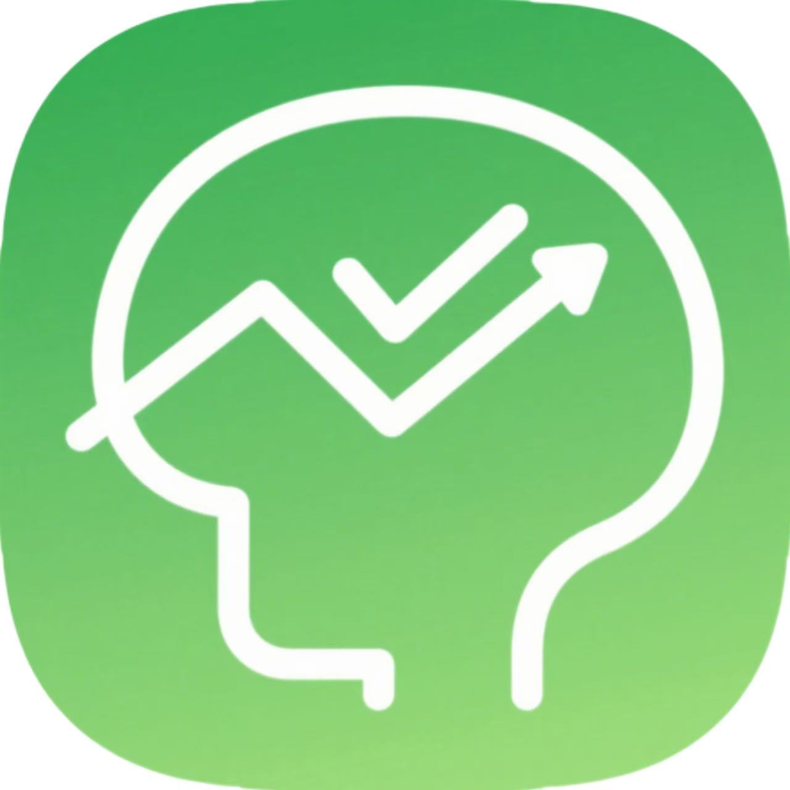
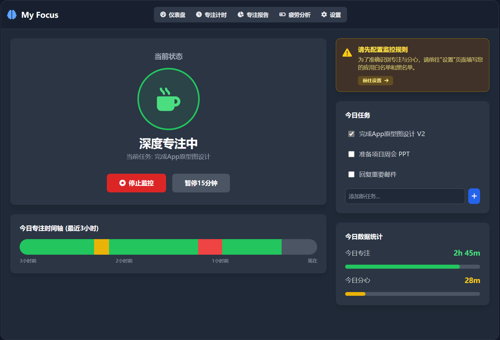
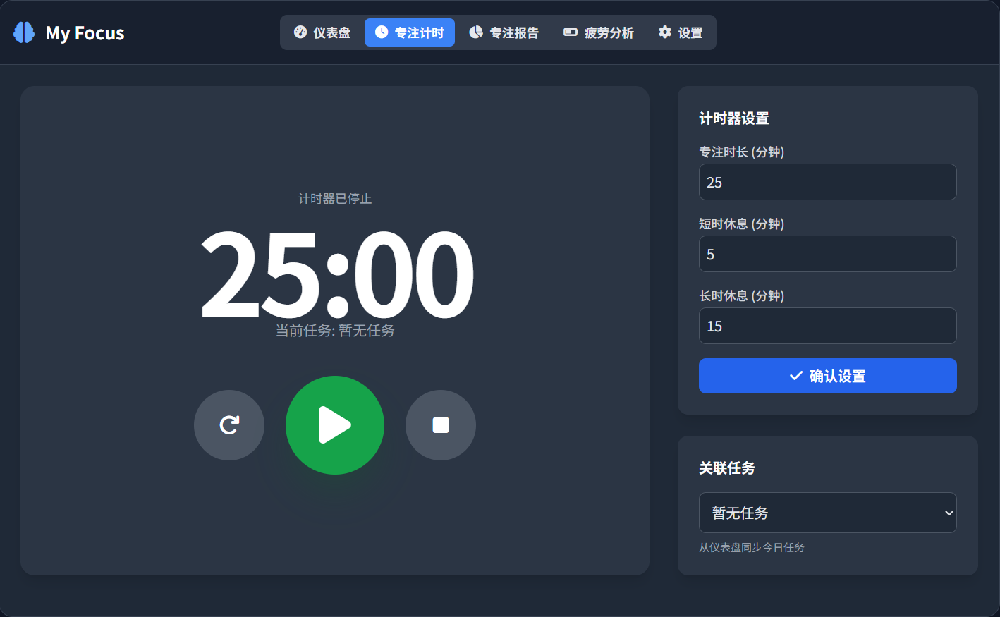
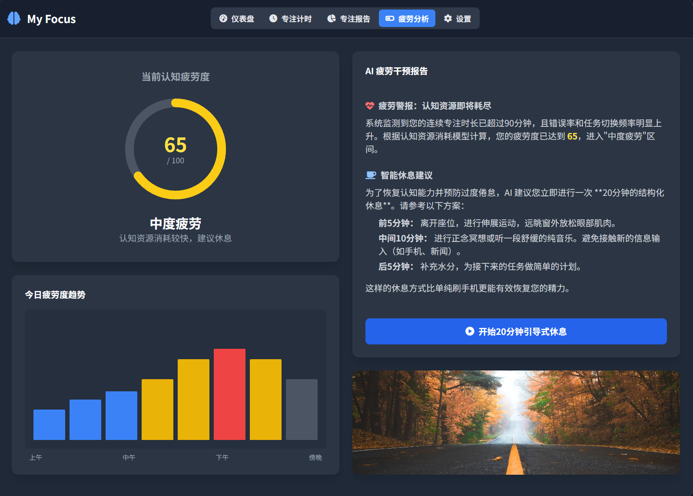
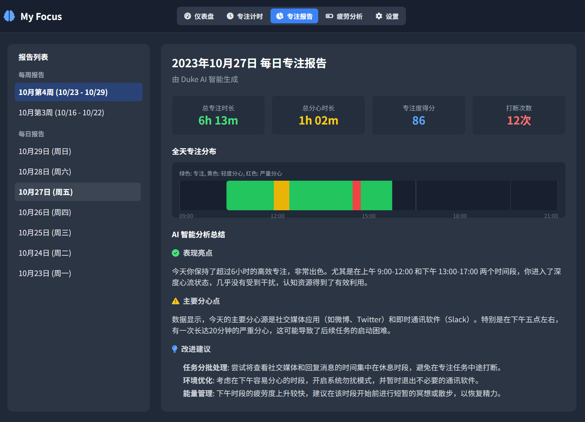

<p align="center">
  <a href="https://github.com/jie0102/My_Focus/releases">
    
  </a>
</p>

<p align="center"><b>My Focus - Focus Monitoring Application</b></p>

<p align="center">English | <a href="./docs/README.zh.md">中文</a> | <a href="https://github.com/jie0102/My_Focus/issues">Feedback</a><br></p>

<p align="center">
  
  
  
</p>

---

## 🧐 Project Introduction

**My Focus** is a desktop focus monitoring application built on the Tauri framework, designed to help users improve their concentration and work efficiency.
The app leverages an intelligent monitoring system and AI analysis to assess your focus in real time and provide personalized improvement suggestions.

<p align="center">
  
  
  
  
</p>

---

## ✨ Features

### Core Features (Completed)

- **Intelligent Monitoring System**
  - Real-time screen monitoring: Periodically captures screen snapshots for AI analysis
  - Application tracking: Tracks active applications and categorizes them
  - Focus state assessment: Uses AI to determine whether you are focused, distracted, or seriously distracted
  - Smart distraction reminders: Automatically reminds you when distraction is detected

- **Flexible Configuration**
  - Multi-AI platform support: OpenAI API, Ollama, Claude, etc.
  - Personalization: Customize monitoring interval, intervention strategies, app whitelist/blacklist
  - Completely local data storage, privacy protection


### In Development & Future Plans
  - **Analysis & Reports**
    - Focus statistics and trend analysis
    - Historical data visualization
    - Integrated task tracking
- AI-powered personalized focus suggestions
- More data visualization features
- Personalized focus learning algorithms
- Team collaboration functions
- Multi-modal judgment: facial expression recognition, etc.
- Mobile and cross-device sync
- Plugin system
- New AI platforms and local model support

---

## 🔒 Privacy Protection

> This project values user privacy to the highest degree—all data and configurations are stored locally, with **no cloud upload or tracking**.
> AI services are only triggered when explicitly authorized by you, with all operations being transparent and controllable.

---

## 🤖 Highly Recommended: Local AI Service with Ollama

**Fully protect your privacy and enjoy local AI support.**
We recommend [Ollama](https://ollama.ai) to run models (such as qwen3) locally for analysis — all your data stays on your device.

- 💡 Runs offline, no network or cloud needed
- 🚀 Excellent performance, fast responses
- 🔐 Data security & privacy guaranteed

```bash
# Pull a model with Ollama
ollama pull <model_name>
```

---

## 🚀 Getting Started

<details>
  <summary><b>System Requirements</b> (click to expand)</summary>

  - Windows 10/11 (main support)
  - 4GB+ RAM (8GB+ recommended)
  - Node.js 18+
  - Rust toolchain (for building)
</details>

1. **Download**: Visit the [Releases](../../releases) page for the latest version.
2. **Install Ollama (Optional):** [Ollama Official Website](https://ollama.ai) — set up a local AI model.
3. **First-time setup:** Choose and configure your AI service in the app's settings page.
4. **Start Focusing:** Launch monitoring and enjoy your focus improvement journey!

#### For Developers

```bash
git clone <repository-url>
cd MyFocus
npm install
npm run tauri:dev   # Development mode
npm run tauri:build # Build for production
```

---

## 🏗️ Technology Stack

| Layer         | Tech Stack                      |
| ------------- | ------------------------------ |
| Frontend      | HTML/CSS/JavaScript + Vite     |
| Backend       | Rust + Tauri Framework         |
| AI Integration| OpenAI, Ollama, Claude         |
| Data Storage  | Local JSON files               |
| OCR Module    | Tesseract                      |
| Cross-Platform| Native app built with Tauri    |

---

## 🤝 Contributing

You're welcome to join our open-source building!

- Submit issues for bugs or suggestions
- PRs for code or documentation
- Help with localization and translation
- Discuss new ideas

---

## 📞 Contact

- **Issue Reporting**: [GitHub Issues](../../issues)
- **Feature Discussion**: [GitHub Discussions](../../discussions)
- **Email**: 609568171@qq.com

---

## 📄 License

This project is licensed under **GNU AGPLv3** - see [LICENSE](LICENSE) for details.

---

## Star Trend

[](https://star-history.com/#jie0102/My_Focus&Date)

---

<p align="center">
  <b>Make focus a habit, make efficiency a reflex.</b><br>
  <i>My Focus - Your dedicated focus management expert, guarding every minute of your concentration.</i>
</p>


